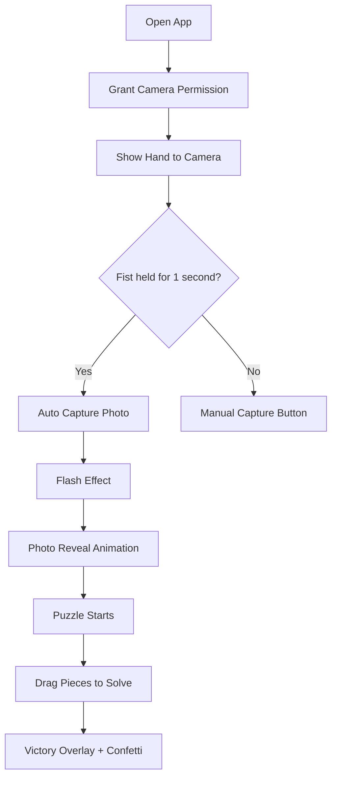

<p align="center">
  
</p>

<h1 align="center">Hand Photo Puzzle</h1>

<p align="center">
  <b>AI + Computer Vision + Interactive Puzzle Game</b><br/>
  Capture a live hand photo with MediaPipe, reveal it with animation, and solve it as a drag-and-drop puzzle.
</p>

<p align="center">
  <a href="https://mohitboura342-ui.github.io/hand-photo-puzzle/">Live Demo</a> ·
  <a href="#features">Features</a> ·
  <a href="#tech-stack">Tech Stack</a> ·
  <a href="#getting-started">Getting Started</a>
</p>

<p align="center">
  
</p>

---

## Overview

**Hand Photo Puzzle** is an interactive browser-based experience that combines real-time hand tracking, photo capture, animated reveal, and a custom puzzle game.

The flow is simple:
1. Open the app in the browser.
2. Show your hand to the camera.
3. Hold a fist for 1 second to auto-capture.
4. Watch the photo reveal animation.
5. Solve the photo puzzle.
6. Celebrate with confetti when completed.

This project is designed as a fun weekend build that blends **AI/ML concepts, creative coding, and UI motion design**.

---

## Features

- Real-time hand tracking using **MediaPipe Hands**.
- Fist-hold gesture detection for auto capture.
- Manual photo capture button.
- Flash effect and cinematic photo reveal.
- Puzzle generation from captured webcam image.
- Drag-and-drop puzzle pieces with snapping logic.
- 3x3, 4x4, and 5x5 difficulty options.
- Move counter and timer.
- Victory screen with confetti animation.
- Restart and capture-new-photo controls.
- Responsive layout for desktop and mobile screens.

---

## Tech Stack

- **HTML5** for structure.
- **CSS3** for glassmorphism UI and animations.
- **JavaScript** for all app logic.
- **Canvas API** for frame capture, slicing, and confetti.
- **MediaPipe Hands** for hand landmark detection.
- **GitHub Pages** for deployment.

---

## Live Demo

Open the deployed version here:

[GitHub Pages Live Demo](https://mohitboura342-ui.github.io/hand-photo-puzzle/)

---

## Project Flow



---

## Getting Started

### Prerequisites

- A modern browser.
- Camera access enabled.
- Internet connection for MediaPipe CDN.

### Installation

1. Clone the repository:
```bash
git clone https://github.com/mohitboura342-ui/hand-photo-puzzle.git
```

2. Open the project folder:
```bash
cd hand-photo-puzzle
```

3. Run it with a local server.

### Run locally

If you use VS Code, install **Live Server** and open `index.html`.

Or use Python:
```bash
python -m http.server 8000
```

Then open:
```text
http://localhost:8000
```

---

## Usage

- Click **Enter Experience**.
- Allow camera permission.
- Open your hand in front of the camera.
- Make a **fist and hold for 1 second** to trigger auto capture.
- Or use **Capture Photo** manually.
- Solve the puzzle by dragging pieces into the correct place.
- Change puzzle size using 3×3, 4×4, or 5×5.
- Use **Restart** to reshuffle the same image.
- Use **Capture New Photo** to return to camera mode.

---

## Controls

| Action | Result |
|---|---|
| Open hand | Detection feedback appears |
| Fist hold for 1 second | Auto capture starts |
| Capture Photo | Manual image download + preview |
| Restart | Rebuilds puzzle with same image |
| Capture New Photo | Returns to live camera |
| Play Again | Replays solved puzzle |

---

## Folder Structure

```text
hand-photo-puzzle/
├── index.html
├── assets/
│   ├── demo.gif
│   ├── hand-photo-puzzle-banner.gif
│   └── screenshot.png
└── README.md
```

---

## How It Works

### Hand detection
MediaPipe Hands tracks landmarks from the webcam feed and estimates whether the hand is open, partial, or closed.

### Capture flow
When the fist-hold threshold is reached, the app captures a frame from the video element using canvas, applies a flash effect, and then reveals the photo before launching the puzzle.

### Puzzle slicing
The captured image is center-cropped into a square and sliced into equal pieces using the Canvas API. Each piece becomes a draggable tile.

### Solving logic
Each tile stores its correct index and current slot index. When all tiles match their intended positions, the victory overlay appears.

---

## Deployment

This project is designed for **GitHub Pages**.

### GitHub Pages setup
1. Push the project to GitHub.
2. Go to **Settings → Pages**.
3. Select **Deploy from a branch**.
4. Choose branch: **main**.
5. Choose folder: **/(root)**.
6. Save and wait for the build to finish.

### Important
If the site is deployed at:
```text
https://mohitboura342-ui.github.io/hand-photo-puzzle/
```

make sure asset paths are relative or use:
```html
<base href="/hand-photo-puzzle/">
```

---

## Browser Support

Best supported on:
- Chrome
- Edge
- Brave
- Firefox
- Safari with camera permissions enabled

---

## Future Ideas

- Add sound effects for capture and puzzle solve.
- Add score ranking based on time and moves.
- Add background music toggle.
- Add more puzzle themes.
- Add image upload mode.
- Add facial gesture trigger support.

---

## Credits

Built using:
- MediaPipe Hands
- HTML Canvas
- Vanilla JavaScript

---

## License

MIT License
